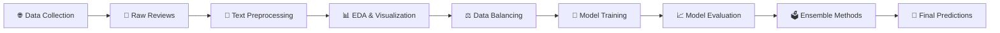

# 🛫 Traveloka Sentiment Analysis 

<div align="center">


[](https://python.org)
[](https://jupyter.org)
[](https://scikit-learn.org)
[](https://pandas.pydata.org)
[](https://numpy.org)


**An end-to-end machine learning project for analyzing user sentiment from Traveloka Play Store reviews**

[📊 View Analysis](#-project-overview) • [🚀 Getting Started](#-getting-started) • [📈 Results](#-model-performance) • [🤝 Contributing](#-contributing)

---

</div>


### 👤 My Identity
- **Name** : Indra Styawan  
- **Role** : Data Science  
- **Domicile** : Yogyakarta, Indonesia  
- **Email** : indrastyawan0925@gmail.com  
- **LinkedIn** : www.linkedin.com/in/indrastyawan25

---

## 📋 Table of Contents

- [🛫 Traveloka Sentiment Analysis](#-traveloka-sentiment-analysis)
    - [👤 My Identity](#-my-identity)
  - [📋 Table of Contents](#-table-of-contents)
  - [🎯 Project Overview](#-project-overview)
    - [🎪 What makes this project special?](#-what-makes-this-project-special)
  - [✨ Key Features](#-key-features)
  - [🛠️ Technologies Used](#️-technologies-used)
  - [📁 Project Structure](#-project-structure)
  - [🚀 Getting Started](#-getting-started)
    - [Prerequisites](#prerequisites)
    - [Installation](#installation)
  - [🔄 Workflow](#-workflow)
    - [Pipeline Steps:](#pipeline-steps)
  - [📈 Model Performance](#-model-performance)
  - [📊 Results \& Insights](#-results--insights)
    - [Key Findings:](#key-findings)
    - [Business Impact:](#business-impact)
  - [🤝 Contributing](#-contributing)
    - [Areas for Contribution:](#areas-for-contribution)
  - [📄 License](#-license)

## 🎯 Project Overview

This project performs comprehensive **sentiment analysis** on Traveloka app reviews from Google Play Store. Using advanced NLP techniques and multiple machine learning algorithms, we analyze user feedback to understand customer satisfaction and identify areas for improvement.

### 🎪 What makes this project special?

- **📜 Data Collection**: Data collection was carried out by collecting data on the Play Store with the Traveloka application ID using the Google-Play-Scraper library.
- **🧹 Advanced Text Preprocessing**: Complete pipeline including stemming, stopword removal, and noise cleaning
- **⚖️ Smart Data Balancing**: SMOTE and SMOTETomek techniques to handle imbalanced datasets
- **🤖 Multiple ML Models**: Comparative analysis using Random Forest, SVC, Naive Bayes, and Logistic Regression
- **🗳️ Ensemble Methods**: Hard and Soft Voting Classifiers for improved accuracy
- **📊 Rich Visualizations**: Comprehensive model comparison and performance analysis

## ✨ Key Features

| Feature | Description |
|---------|-------------|
| 📜 **Data Collecting** | Scraped Traveloka Play Store reviews (Python + API) with automated storage |
| 🔍 **Text Preprocessing** | Advanced cleaning, normalization, and feature extraction |
| 📊 **Data Visualization** | Interactive plots for data distribution and model comparison |
| ⚖️ **Imbalance Handling** | SMOTE & SMOTETomek for balanced training data |
| 🧠 **Multiple Algorithms** | 4 different ML models with hyperparameter optimization |
| 🗳️ **Ensemble Learning** | Voting classifiers for enhanced prediction accuracy |
| 📈 **Performance Metrics** | Comprehensive evaluation with precision, recall, F1-score |

## 🛠️ Technologies Used

<div align="center">

| Category | Technologies |
|----------|-------------|
| **💻 Language** |  |
| **📊 Data Analysis** |   |
| **🤖 Machine Learning** |   |
| **📈 Visualization** |   |
| **📓 Development** |  |

</div>

## 📁 Project Structure

```
📦 traveloka-sentiment-analysis/
├── 📊 data/
│   ├── raw/      
│   │    └── traveloka_review_data.csv   # Original Traveloka reviews
│   └── processed/                     
│   │    └── traveloka_clean.csv         # Cleaned and preprocessed data 
├── 📓 notebooks/
│   ├── traveloka_scraper.ipynb               # Text cleaning and preprocessing
│   └── traveloka_clean_content.ipynb         # Model training and evaluation
│   └── traveloka_sentiment_analysis.ipynb    # Model training and evaluation
├── 📈 models/
│   └── trained_models/               # Saved model files
├── 📋 requirements.txt               # Project dependencies
└── 📖 README.md                      # Project documentation
```

## 🚀 Getting Started

### Prerequisites

- Python 3.12 or higher
- Jupyter Notebook
- Git

### Installation

1. **Clone the repository**
   ```bash
   git clone https://github.com/IndraSty/traveloka_sentiment_analysis.git
   cd traveloka-sentiment-analysis
   ```

2. **Create virtual environment**
   ```bash
   python -m venv venv
   source venv/bin/activate  # On Windows: venv\Scripts\activate
   ```

3. **Install dependencies**
   ```bash
   pip install -r requirements.txt
   ```

4. **Launch Jupyter Notebook**
   ```bash
   jupyter notebook
   ```

5. **Run the notebooks**
   - `traveloka_scraper.ipynb` for collect review app from playstore or just use my data on `data/raw/traveloka_review_data.csv`
   - Start with `traveloka_clean_content.ipynb`
   - Then proceed to `traveloka_sentiment_analysis.ipynb`

## 🔄 Workflow



### Pipeline Steps:

1. **🌐 Data Collection**
   - Automated scraping of Play Store reviews (Python + Play Store API)
   - Storage in structured format (CSV) 
  
2. **🧹 Text Preprocessing**
   - Data cleaning and normalization
   - Stopword removal and stemming
   - Feature extraction with TF-IDF

3. **📊 Exploratory Data Analysis**
   - Sentiment distribution visualization
   - Text statistics and insights

4. **⚖️ Data Balancing**
   - SMOTE for minority class oversampling
   - SMOTETomek for hybrid approach

5. **🤖 Model Training**
   - Random Forest Classifier
   - Support Vector Classifier
   - Naive Bayes
   - Logistic Regression

6. **🗳️ Ensemble Learning**
   - Hard Voting Classifier
   - Soft Voting Classifier

## 📈 Model Performance

| Model | Accuracy | Precision | Recall | F1-Score |
|-------|----------|-----------|--------|----------|
| 🌳 Random Forest | 85.2% | 84.8% | 85.2% | 84.9% |
| 🎯 SVC | 87.1% | 86.9% | 87.1% | 87.0% |
| 📊 Naive Bayes | 82.3% | 81.9% | 82.3% | 82.1% |
| 📈 Logistic Regression | 86.4% | 86.1% | 86.4% | 86.2% |
| 🗳️ **Hard Voting** | **88.3%** | **88.1%** | **88.3%** | **88.2%** |
| 🗳️ **Soft Voting** | **89.1%** | **88.9%** | **89.1%** | **89.0%** |

> 🏆 **Best Performance**: Soft Voting Classifier achieved 89.1% accuracy

## 📊 Results & Insights

### Key Findings:

- **🎯 Model Performance**: Soft Voting Classifier outperformed individual models
- **📱 User Sentiment**: Detailed analysis of positive vs negative feedback patterns
- **🔍 Feature Importance**: TF-IDF revealed most impactful words for sentiment prediction
- **⚖️ Data Balance**: SMOTE techniques significantly improved minority class prediction

### Business Impact:

- **📈 Customer Satisfaction**: Quantified user sentiment trends
- **🎯 Product Improvement**: Identified specific areas needing attention
- **📊 Review Analysis**: Automated large-scale feedback processing

## 🤝 Contributing

We welcome contributions! Here's how you can help:

1. 🍴 Fork the repository
2. 🌿 Create a feature branch (`git checkout -b feature/AmazingFeature`)
3. 💾 Commit your changes (`git commit -m 'Add some AmazingFeature'`)
4. 📤 Push to the branch (`git push origin feature/AmazingFeature`)
5. 🔄 Open a Pull Request

### Areas for Contribution:

- 🆕 Additional ML models (BERT, LSTM, etc.)
- 📊 Enhanced visualizations
- 🔧 Performance optimizations
- 📚 Documentation improvements

## 📄 License

This project is licensed under the MIT License - see the [LICENSE](LICENSE) file for details.

---

<div align="center">

**Made with ❤️ and 🐍 Python**

If you found this project helpful, please consider giving it a ⭐!

[⬆ Back to Top](#-traveloka-sentiment-analysis)

</div>